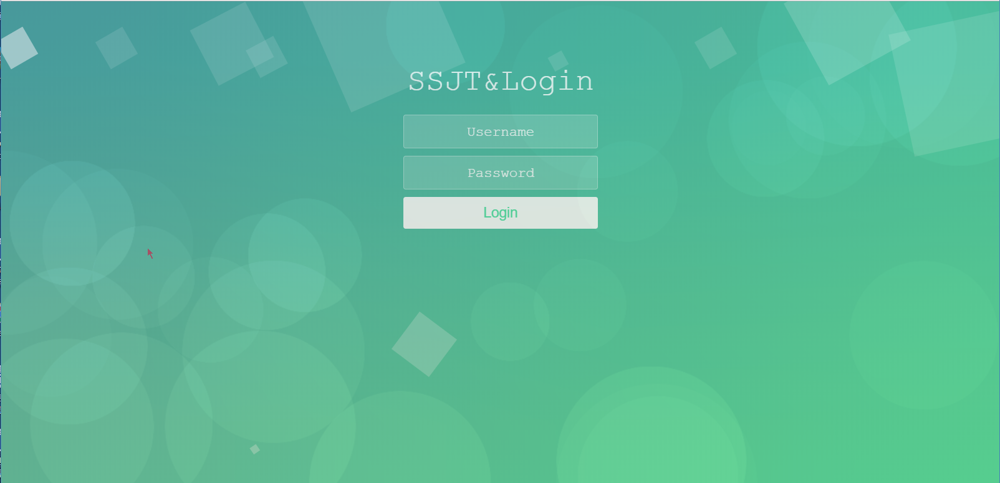

##效果图：



## 简要教程

background.js是一款HTML5 canvas梦幻圆形泡泡动画背景特效。通过background.js插件，你可以轻松的制作出带渐变效果的气泡动画背景效果，并且背景颜色能在4种颜色间平滑过渡转换。

## background.js插件的特点还有：

- 支持4种渐变颜色。
- 实现梦幻泡泡效果。
- 动画平滑过渡效果。
- 检测移动设备并尝试优化资源。
- 纯JavaScript制作，没有任何依赖。

### 使用方法

- 在页面中引入background.js文件。

```JS
<script src="path/to/background.js"></script>
```

- HTML结构

 __使用<canvas>元素来创建背景。__

```html
<canvas id="background"></canvas>    
```              
###  CSS样式

__如果要制作全屏效果，可以使用下面的css代码将<canvas>元素固定在视口中。__

```css
#background {
  position: fixed;
  top: 0;
  left: 0;
  z-index: -100;
}  
```                

### 配置参数
background.js创建可以修改的配置参数如下：
```js
var options =
  {
    resolution: 1,
    gradient:
    {
      resolution: 4,
      smallRadius: 0,
      hue:
      {
        min: 0,
        max: 360
      },
      saturation:
      {
        min: 40,
        max: 80
      },
      lightness:
      {
        min: 25,
        max: 35
      }
    },
    bokeh:
    {
      count: 30,
      size:
      {
        min: 0.1,
        max: 0.3
      },
      alpha:
      {
        min: 0.05,
        max: 0.4
      },
      jitter:
      {
        x: 0.3,
        y: 0.3
      }
    },
    speed:
    {
      min: 0.0001,
      max: 0.001
    },
    debug:
    {
      strokeBokeh: false,
      showFps: false
    }
  };   

```               
> background.js-HTML5 canvas梦幻圆形泡泡动画背景特效的github地址为：https://github.com/pbondoer/bubble-bg

